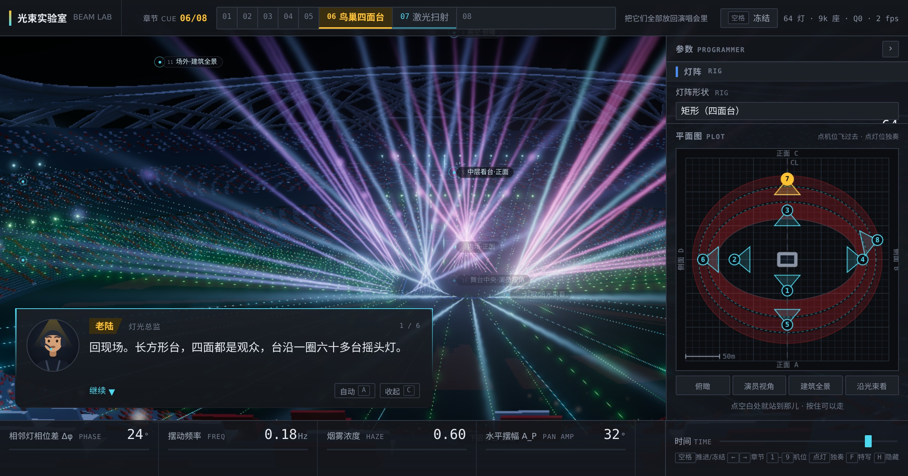

# 光束实验室 · BEAM LAB

> 演唱会舞台上那些「拐弯」的光束，到底是怎么回事。

<p align="center">
  <a href="https://pekingspades.github.io/stage-light-illusion/">
    
  </a>
</p>

<p align="center">
  <a href="https://pekingspades.github.io/stage-light-illusion/"><strong>▶ 在线演示 / Live demo</strong></a>
</p>

<p align="center">
  <a href="LICENSE"></a>
  
  
  
  <a href="../../actions/workflows/deploy.yml"></a>
</p>

> **In English** — Light travels in straight lines, yet at a concert the beams
> visibly *curve*. This is an interactive 3D explainer, built around one claim:
> **the beams really are straight — the curve you see is their _envelope_, and in
> most cases it does not exist in space at all.** It only appears after projection,
> which is why the shape changes when you move to a different seat.
> Eight guided chapters, free-fly camera, a lighting-console UI, and a to-scale
> model of Beijing's Bird's Nest stadium. Chinese-language UI.
> [Open the demo →](https://pekingspades.github.io/stage-light-illusion/)

用可自由绕飞的 3D 场景，还原并**解释**演唱会四面台上「光线拐弯」的视觉效果。

核心论点一句话：**光是直的，弯的是做法。**

起因：在北京鸟巢看演唱会。舞台是长方形四面台，观众 360° 环绕，台沿一圈摇头光束灯。
光线明明沿直线传播，可看上去舞台灯光就是在以优美的曲线不停变化流动。这个页面把它拆开来演示。

## 目录

- [核心结论](#核心结论三句话互不混淆) · [跑起来](#跑起来) · [界面](#界面) · [操作](#操作) · [移动端](#移动端)
- [代码结构](#代码结构) · [场馆建模](#场馆建模) · [激光扫射](#激光扫射驱动量是落点不是转角) · [性能](#性能分档与暂停)
- [灯具建模](#灯具建模) · [运动模型](#运动模型) · [数学验证](#数学部分的验证) · [取舍](#几处刻意的取舍)
- [参与](#参与) · [许可](#许可) · [致谢](#致谢)

## 核心结论（三句话，互不混淆）

1. **每一束光都是直线。** 透视投影是射影变换，直线的像永远是直线——所以单看任何一束，从任何角度都不弯。
2. **你看到的曲线是这一族直线的包络（envelope）。** 它与族中每一条直线相切。数学上和"用直线绣出曲线"的弦线艺术是同一件事。
3. **多数情况下，这条曲线并不存在于空间中。** 真实演出里光束互不共面（异面），空间中相邻两束光根本不相交；那条弯的光带只在**投影**之后才出现——换个座位，它就换个形状。

两个常见的错误归因，本页面刻意避开：
- **相位差**只负责让曲线"流动"，不负责"弯曲"。相位差归零，曲线塌成一面平墙，但它本来也不是弯的成因。
- **烟雾**只负责让光束"可见"，不负责"弯曲"。烟雾归零，光束整根消失，只剩看台上的光斑还在跳。

唯一的例外是第 ⑤ 章：光束扫出**单叶双曲面**时，弯曲是货真价实的空间事实——一个完全由直线构成的曲面。

## 跑起来

```bash
npm install
npm run dev        # http://localhost:5173
```

```bash
npm run build && npm run preview   # 静态产物在 dist/，可直接丢到任意静态托管
```

需要支持 WebGL2 的浏览器。帧率不足时会自动降档，**先降座椅密度、后降渲染分辨率**——
前者几乎看不出来（抽稀时会按比例加宽座椅，远看仍是连续的红色带），后者会让整屏发虚。
灯数任何时候都不减：那是演示内容本身。

## 界面

界面刻意分成两套语气，互不越界：

- **控台是硬的**——参数、机位、灯位、平面图一律方角、极暗底、语义色、等宽数字。这不是审美偏好：
  灯光台真长这样。现场全黑，瞳孔已经适应暗环境，界面一亮就看不见舞台了；信息密度高、误触代价大，
  所以字要小、格要密、状态要一眼可辨。
- **人是软的**——全场只有老陆（灯光总监）的对话框允许出现圆角、渐变和动效。

二者不打架的机制：**讲解从不长在控件上**（没有 tooltip 式说教），**控件也从不写句子**（只有术语和数值）。

```
┌──────────────────────────────────────────────┬──────────────┐
│ 顶栏  标题 │ 章节序列轨 01…08 │  冻结 · 状态   │              │
├──────────────────────────────────────────────┤  参数栏      │
│                                              │  encoder 行  │
│   3D 视口（机位热点直接标在场景里）           │  ├ 灯阵      │
│                                              │  ├ 运动      │
│   ┌────────────────────┐                     │  ├ 氛围      │
│   │ 老陆 · 对话框       │                     │  └ 证据图层  │
│   └────────────────────┘                     │  ─────────── │
│                                              │  平面图 PLOT │
├──────────────────────────────────────────────┴──────────────┤
│ 编码条  4 个常用参数（随章节切换）  │  时间轴 │ 快捷键       │
└─────────────────────────────────────────────────────────────┘
```

## 操作

**机位标在场景里，点它就飞过去。**不用去菜单里找"第 3 个视角"——那个圆圈就悬在对应的座位上，
跑到画面外会吸附到边缘，被舞台或看台挡住会变半透明但依然能点。

**平面图叠了座位简易平面图**：三层看台画成填充的红色椭圆环、层间没有观众的环廊画成青色虚线圈，
一眼看出"哪儿是座位、哪儿是空的"——这也正好解释了激光为什么只能沿环廊扫。

**机位分两类**：座位机位（内场 / 下层 / 中层 / 上层，各有"正面"和"侧面"共 8 个，
高度自动落在该处真实的踏面上）与工具机位（俯瞰 / 舞台中央 / 场外全景 / 灯眼）。
**平面图不只是这些预设**：点空白处就站到那一点去，按住拖动还能贴着场地走。落点高度按那里的地面算——
内场是平地、看台是阶梯、舞台上再加台面高度，所以永远是"站着的人眼"。图上那个跟着你实时转的空心楔形，
随时告诉你自己站在哪、朝哪看。

| 操作 | 作用 |
| --- | --- |
| 点场景里的圆圈热点 / 平面图上的楔形 | 飞到那个机位 |
| **平面图上点空白处** | 就站到那儿去；**按住拖动**可以贴着场地一路走过来 |
| **点看台任意一处（3D 里）** | 就坐在那儿看——预设只有 6 个，座位是无穷个 |
| **点任意一台灯** | 独奏它（其余压暗），顶栏显示它此刻的 pan / tilt 实时读数 |
| <kbd>F</kbd> | 飞到被独奏那台灯跟前看它的构造（灯光台上把这个动作叫 focus） |
| 拖参数行 | 像转编码轮一样改值；<kbd>Shift</kbd> 精调，双击回本章默认值，滚轮微调 |
| <kbd>空格</kbd> | 推进老陆的讲解；讲完之后落回"冻结时间" |
| <kbd>1</kbd>–<kbd>9</kbd> / <kbd>0</kbd> | 机位预设 / 交还自由视角（共 12 个机位，其余在平面图与机位列表里点） |
| <kbd>←</kbd> <kbd>→</kbd> | 上一章 / 下一章 |
| <kbd>C</kbd> / <kbd>A</kbd> / <kbd>H</kbd> | 收起对话框 / 自动播放 / 隐藏全部界面 |
| 拖动 · 滚轮 · 右键拖动 | 旋转 · 缩放 · 平移（任何时候一动手就自动脱离预设） |

参数行左端那条 3px 的组色竖条只在"值 ≠ 本章默认"时点亮——灯光师管这叫 programmer 层，
一眼看出自己动过哪些参数。

最有说服力的两个交互：
- **机位 6「灯眼」**：摄像机骑在光束上顺着它看，整束光被压缩成一个点，且灯头怎么摆它都还是一个点。
- **第 ④ 章按 <kbd>1</kbd> / <kbd>2</kbd> 来回切**：同一瞬间、同一批光束，金色曲线的形状完全变了。

## 图层配色约定

| 颜色 | 含义 |
| --- | --- |
| 金色曲线 + 金色小点 | **屏幕空间包络**，即你眼睛真正看到的那条曲线；小点是它与每一束光的切点。每帧随相机重算。 |
| 青色曲线 | **三维腰线**（striction curve），相邻两束光在空间中真正最接近的那些点。它与金色曲线**不是**同一条线。 |
| 淡青细直线 | 光束延长线，笔直穿过整个场馆。 |

## 移动端

触摸设备走另一套版面，**不追求把桌面端的每一项交互都搬过来**——够用且不挡画面更重要。

断点不只看宽度：iPad 横屏是 1024px 宽却是手指操作，所以判据是
`(max-width: 900px), (pointer: coarse) and (max-width: 1200px)`。

- 底部一排工具栏取代全部快捷键：**讲解 / 平面图 / 机位 / 参数 / 冻结**，一次只开一块，最小 56px 高。
- 参数面板保留 encoder 行，但 `touch-action: pan-y`——纵向交给浏览器滚动，横向留给改值；
  少了这句，参数抽屉根本滑不动。
- **平面图是移动端最好用的移动方式**：点一下就站过去，不用在小屏上跟三维视角较劲。
- 场景热点只留序号，命中区仍是 44px。
- 竖屏用底部抽屉；**横屏把两组菜单分到画面左右两侧**——工具栏竖过来放左边，参数/平面图抽屉从右边滑出，
  中间整块留给舞台。横屏时手是端在两边的，左右正好是拇指够得到的地方，而底部横条会把本来就矮的画面压没。
- 工具栏图标一律内联 SVG：`▦ ◎ ⏸` 这类符号字形在很多设备的字体里缺失，会渲成豆腐块。

实测过 8 种常见尺寸，均无横/纵向溢出、无小于 30px 的触摸目标、无 console 报错：
iPhone SE 375×667、iPhone 13 390×844、15 Pro Max 430×932、Android 360×800、Pixel 412×915、
横屏 844×390、iPad 竖屏 768×1024、iPad 横屏 1024×768。

## 代码结构

```
index.html
src/
  main.js                  装配 + 主循环 + 交互 + 场景拾取
  styles.css               设计令牌与版面（控台冷灰 + 对话框暖角）
  math/
    lines.js               异面直线最近点、三维包络（纯数值，无 three 依赖）
    screenEnvelope.js      投影 + 屏幕空间包络的解析解
  scene/
    rig.js                 灯阵几何（矩形/圆环/单排）与 pan-tilt 运动模型
  render/
    pipeline.js            renderer / scene / camera / bloom 后期链
    fixtureModel.js        摇头灯建模（底座/摇臂/灯头/透镜/小屏，5 个 InstancedMesh）
    beams.js               体积光束：绕轴 billboard 条带 + 实例化，一个 draw call
    spots.js               看台墙面上的椭圆光斑
    glows.js               灯口辉光
    guides.js              延长线 + 三维腰线
    venue.js               场馆、看台碗、鸟巢式编织钢构、观众
    cameraRig.js           OrbitControls + 机位预设 + 锚点 + 阻尼飞行
  ui/
    content.js             默认参数、控件表、章节定义、老陆的台词
    panel.js               encoder 风格参数面板（整行可拖 + 原生 range 兜住键盘/读屏）
    hotspots.js            场景内机位热点（HTML 覆盖层 + 解析遮挡判定）
    planview.js            2D 平面图：灯位符号、朝向三角、机位楔形、实时相机
    dialogue.js            老陆的对话系统（打字机 + 状态机 + 自动分页）
    overlay2d.js           2D 叠加层（包络、切点、拖尾、标注）
```

## 场馆建模

场馆按国家体育场（鸟巢）**真实尺度**建模，唯一真相源是 `src/render/venueGeometry.js`。

### 为什么改成真实尺度

前几版把场馆压缩了 0.35（做成 116×100 m），但舞台、座椅、人、灯具全是真尺寸。
这种"半压缩"同时惹出三个问题：跑道被压扁而座椅没有（比例不对）、
看台碗做成**正圆** r=53 m 而外壳是椭圆短轴只有 45 m（**座椅穿出外壳 8 m**）、
长短轴比失真（外形不对）。所以这一版一次改到底：全部真实米制、全部椭圆。

代价是整套"距离量级"都得跟着走——雾密度、相机远裁剪、观众点精灵尺寸、平面图网格、
光束长度、OrbitControls 距离上限。**只改几何不改这些，结果是黑屏或一团灰雾**（我确实先撞了一次）。

### 尺寸对照

| 要素 | 本模型 | 真机 / 标准 |
| --- | --- | --- |
| 建筑檐口 | 332 × 297 m | 333 × 294 m |
| 建筑总高 | 69 m | 69 m |
| **檐口起伏（马鞍屋盖）** | 42.8 ~ 68.5 m | 42.8 ~ 68.5 m |
| 屋盖开口 | 185 × 128 m | — |
| 看台外沿 | 280 × 248 m | — |
| 看台首排 | 208 × 120 m | — |
| 跑道外沿 | 179 × 95 m | 400 m 9 道标准 |
| 足球场 | 105 × 68 m | 国际标准 |
| 固定座位 | 74,128 张 | 约 80,000 张 |

### 外壳：三条前几版都做反的事

参考资料是用户提供的 SketchUp 模型（`src/model/niaochao1.skp`）和 19 张截图（`src/image/`）。

1. **立面是向外倾的，上大下小**。柱脚圈 153×136.5 m（24 榀桁架柱、柱距 37.96 m，
   按周长 911 m 反算），到檐口张到 166.15×148.65 m，外倾约 13°。
   我原先做成"从地面往上收口的碗"，方向整个是反的。
2. **屋盖是马鞍形**，檐口标高随方位在 42.8~68.5 m 之间起伏、相差 25.7 m，
   高点在短轴侧、低点在长轴端。这条起伏是鸟巢侧影的灵魂；原先只叠了 1.8 m 的装饰性波动，相位还是反的。
3. **屋盖开口长宽比 1.45，比整体的 1.12 细长**，所以长短轴必须各自插值，不能共用一个半径系数。

**编织**：早先用两族方向相反、间隔均匀的构件交叉，得到的是规整的席编；真机是几百根走向各异的
杆件互穿。现在每根构件的起始方位、扭转量（含正负）、跨越区间、贴面深度全部由**定种子**的
伪随机数发生器给出——看着乱，每次刷新一样。截面统一 1.2 m 见方箱形（真机就是这样，
这正是"看不出主次构件"的视觉根源）。

### 看台：椭圆环，两侧比两端深得多

平面比例从用户给的真实座位图 `src/image/2018706144452_37781.jpg` **逐像素量出来**，
再用 400 m 跑道外廓标定。量测结果里最关键的一条是：内外两条边界的**长短轴比完全不同**
（内圈 1.55 细长、外圈 1.09 接近圆），**侧面进深 59 m 而两端只有 38 m**。
这说明看台不是把内圈等距外扩得到的——两侧堆得深，把整体拉圆。

所以每一排按"从内边界到外边界的**比例** s∈[0,1]"定位。这样做有两个好处：每层顶沿高度全场一致，
而且**座椅在构造上就不可能跑出外边界**——那个穿模 bug 从根上没了。
代价是排距随方向变化（两侧约 1.0 m、两端约 0.6 m），也就是两端更陡；
真实体育场的两端（球门后）本来也比侧面陡。riser 由两端的坡度反推定死：两端 ≤40°。

| 层 | s 区间 | 首排标高 | 排数 | 侧/端坡度 | 顶沿 |
| --- | --- | --- | --- | --- | --- |
| 下层 | 0.00–0.36 | +1.2 m | 24 | 26° / 38° | 11.8 m |
| 中层 | 0.42–0.72 | +17.5 m | 20 | 28° / 39° | 26.9 m |
| 上层 | 0.78–1.00 | +32.0 m | 15 | 28° / 40° | 38.9 m |

**座椅 74,128 张，逐张实例化，一个 draw call**（移动端隔四取一，18,538 张）。
座宽 0.46 m、中心距 0.50 m、座面高 0.42 m、靠背后仰 12°。沿椭圆**按弧长等分**——
椭圆上等角度并不等弧长，直接按角度分会让两端的座位挤成一团。

**配色**两份参考互相印证：.skp 里的看台贴图 `bei_stopnice.jpg` 采样得深红（#491615–#852322），
高清截图 `img_008.jpg` 显示结构是**亮红椅里随机掺近白椅、越往上白椅越多**
（下层约 8%、上层到一半）。取亮红 #d8232a / 近白 #d8d4cb。

### 数值验收（写成断言，不靠眼睛）

| 断言 | 结果 |
| --- | --- |
| 座椅不穿壳：所有座位相对柱脚圈的椭圆占比 < 0.85 | 最大 0.834 ✓ |
| 首排不压跑道：跑道外沿 360 点全部在首排椭圆内 | 最小净距 12.5 m ✓ |
| 看台顶低于檐口最低点 | 38.9 m < 42.8 m ✓ |
| 座位数量级 | 74,128（真机约 8 万）✓ |

（第一版的跑道断言我自己写错了——拿椭圆**参数角**当极角比，得出 1.7 m 的假告警；
椭圆上这两个角不是一回事。）

## 界面：两处密度问题

**顶栏的章节切换。** 原先是 8 个并列方瓦。问题不在丑，在于它把**有顺序的教学流程**
（1→8 层层递进）画成了 8 个平行开关：读不出现在第几、总共几、下一个是谁。
现在合成一条连续的 **CUE 序列轨**——等宽刻度段 + 段内序号 + 播放头 + 字段头 `07/08` 读数。

刻意**不做"走过的段镀金"那种进度条**：应用默认落在第 7 章，
一进来就显示"8 章已走 6 章"是句谎话。轨表达的是**位置**，不是**进度**。

装不下时逐级让步（一级：非当前段收成数字刻度；二级：让出本章标题；三级：只留当前段的名字），
判据是"标签真的被截断了"而不是写死的断点宽度——写死断点等于把它和"章节数 × 中文名长度"绑死。

> 这里有个容易上当的地方：**别用 `scrollWidth > clientWidth` 判文字截断**。
> 这两个属性都是取整的，文字需要 60.0px、盒子只有 59.5px 时两边都读成 60，检测不到；
> 而 CSS 的 ellipsis 对这 0.5px 毫不留情——省略号自己也要占位置，
> "鸟巢四面台"直接掉成"鸟巢四…"，一口气丢两个字。要用 `Range.getBoundingClientRect()` 量小数宽度。

**平面图上的机位太密。** 12 个机位有 9 对重叠，比例尺只有 0.72 px/m 而命中半径写死 11px：

- 6 个看台机位全挤在 +Z 与 +X 两条射线上，最近的一对只差 **9.4px**；
- 俯瞰／演员／灯眼三个机位坐标几乎完全相同（相距 **0.0 与 0.4px**），
  而 `_pick` 按列表序返回首个命中——后两个**永远点不中**；
- 场外全景半径 378m 远超 extent，画布坐标 (315,367) **在 288px 画布之外**，看不见也点不到。

三条分别对治：

1. **八个座位机位绕场分到四条边**。四面台有两个正面（±z）、两个侧面（±x），
   正面在 ±z 之间交替、侧面在 ±x 之间交替，每条射线上只剩两个标记。
   三层侧面全压在长轴端时最近仍只有 22.8px，所以最外那个沿弧偏 14°，拉到 **31.78px**。
2. **四个工具机位下沉成一排"视角键"**。它们是"视角"不是"场地上的位置"，
   俯视投影里本来就没有可区分的落点；按钮这个载体不承诺空间位置，也就不会说谎。
3. **`extent` 175 → 150**。平面图从来没画过建筑檐口（`wall` 传的是 `BOWL.inner`），
   最大绘制要素是看台外沿 140，按 175 留边等于白扔 20% 半径。比例尺因此抬到 **0.88 px/m**，
   而 rail 一个像素没加宽。

命中判定同时从"列表序首中"改成**最近者胜**，并按 `pointerType` 分档（手指 16 / 鼠标 14）。
前者是纯收益：以后加机位再密也只是"点准一点"，不会再产生点不到的东西。

顺带修掉两个被牵出来的既有 bug：`syncCurrentPreset()` 在相机**飞行途中**就清掉 `currentPresetId`
（飞行中距离必然超阈值），而清空后第一行就 return、再也不恢复——所以"当前机位"那点金色其实从来没亮过；
以及第 ④ 章台词里的 `act: { cam: 'side' }` 是个不存在的 id（应为 `infield-side`），静默 no-op，
那句"按 2 换到侧面座位"从来没真的切过机位。

## 激光扫射：驱动量是落点，不是转角

看台上那一圈激光是另一套东西，和摇头灯**各自独立开关，也可以同时开**。
它不能乱扫——功率高，直射眼睛有危险，所以只走**层与层之间没有观众的环廊空带**。
现场只有**两排**：下层环廊与中层环廊。最顶上那层看台的上沿不打——再往上是屋盖钢构，
而顶排观众的头就在边上。

有三条现场观察决定了整套实现的形状：

**① 一侧的激光只服务一侧。** 装在舞台 +z 边上的那排只扫正对着它的那段看台，来回平扫，
不绕过去。所以激光按边分组（四面台就是 4 组），各管一段圆弧。

**② 每台激光都扫完整个扇区，走到扇区端点立刻掉头。**
不是整排一起往一边平移再一起折回——那样看着就是一块光斑在滑动，很假；
也不是每台只守着扇区里的一小片——那样每台的行程都太短，看不出"大幅横扫"。

**③ 可是相邻落点的间距还得保持不变。** 这三条乍看互相打架，其实有一个很干净的解：
**只用相位差驱动，不加任何固定偏移**。

设所有激光共用同一条三角波 `f`，第 k 台是 `f(t + kδ)`。三角波的斜率是常数 ±v，于是

```
相邻落点间距 = f(t + (k+1)δ) − f(t + kδ) = ±δ·v
```

大小恒为 `δ·v`，**两个扫射方向上完全相同**——只是整排的先后次序反过来。
同时每台走的都是整条三角波，也就是整个扇区；而各台相位不同，掉头自然逐台发生，
像一道波传过整排。间距和掉头波的速度由同一个量 δ 决定，本来就是一回事。

驱动量必须是**落点沿环廊的弧长**而不是转角：椭圆上等角度并不等弧长，
按转角驱动的话间距在两端会明显被拉开。

（我在这儿绕过一次弯路：早先版本在相位差之外还给每台加了一个固定偏移 `k·L`，
`间距 = L ± δ·v` 于是在两个方向上一大一小，实测 8.1 m vs 1.2 m，一个方向上整排几乎叠在一起。
去掉固定偏移，这个不对称就彻底消失了。）

**④ 每台激光的角速度都不一样。** 这不是额外设计，而是"按弧长驱动"的副产品——
椭圆上同样的弧长在不同位置对应不同的转角。这一条也是现场能看出来的。

反解就是现场那道"标定"：已知光源 P 与目标落点 Q（在环廊椭圆上、标高恒定），
水平距离 t = |Q−P| 的水平分量，俯仰角 θ = atan2(Q_y − P_y, t)。
落点是给定的，所以落点标高天然恒等——那条水平光带因此笔直，不会参差不齐。

**数值验收**（同一条边、同一条环廊，11 台激光，一个完整周期采 2000 帧）：

| 现象 | 实测 |
| --- | --- |
| 每台扫过的行程 / 扇区 | 11 台全是 **100.0%** |
| 相邻落点间距 | 5.78 m，p05 = 中位数 = p95，**两个方向同值** |
| 间距处于恒定值的时间 | **99%**（其余 1% 是掉头交叉的瞬间） |
| 各台首次掉头时刻 | 0.45 / 0.91 / 1.36 / 1.82 / 2.27 … s，逐台错开 **0.45 s** |
| 水平角速度 | 6.9 ~ 9.8 °/s，**单台内部就变化 1.42 倍** |
| 落点标高起伏 | 14.6300 m 与 29.4500 m，起伏 **0.000000 m** |
| 同时的光束长度跨度 | 75 ~ 122 m |

最后两行放在一起看才有意思：光束长度差了 47 m，落点标高却一动不动——这就是"标定"的意思。

参数扫描（每边 2/5/11/13/20 台 × 间距 0.01/0.05/0.09 × 覆盖 0.30/0.74/1.00，共 45 组）
全部满足：行程 ≥ 99.9% 扇区、间距恒定占比 ≥ 91%、无一帧越出扇区。

唯一的例外仍然是掉头：某台已经折返、邻居还没折返的那一小段时间里，两者会交错而过。
这发生在扇区端点附近（数得出来：交叉点在 0.475·S 处），也正是现场看到光扇在两端收拢的地方。

总相位跨度必须小于半个周期，否则排尾会折回来撞上排头，所以 δ 有一个 `0.42/(n−1)` 的上限；
台数拉到很大时它会接住，代价只是间距略小于设定值（见上表 20 台那几行）。

四块区域**不必连续**：每条边只覆盖它那 90° 扇区的 72%，四角留空——现场也不是连成一圈的。

**实例缓冲的容量必须从参数上限推导，不能写字面量。** 这里踩过一次：容量写死 64，
而灯位数 = 边数 × 环廊条数 × 每边台数，每边 ≥ 9 台就越界。
`Math.min(n, capacity)` 的截断是静默的，而灯位按边依次生成——丢的不是零散几条，
而是**末尾整整一条边**。症状是"俯视只有三面有激光"，看着像几何算错，其实是数组不够长。
现在三个因子各自从真相源取（滑杆 max 从 `CONTROLS_FLAT` 查），并在造完灯位时断言容量够用。

渲染上激光和灯光束是两回事：激光物理上只有几毫米粗，真按世界尺度画，一百米外就细到亚像素、
整条线闪成虚线。所以给它**屏幕空间最小宽度**——深度越大，世界尺度的半宽按比例撑大，
屏幕上始终占住那一两个像素。横截面也锐得多（极窄亮芯 + 一点点晕），
这正是它看起来"像一根线"而灯光束"像一根柱"的原因。

## 性能：分档与暂停

座椅是全场最大的开销（满密度 7.4 万实例、178 万三角），而设备差异极大，所以不写死一个值：

| 档 | 座椅 | 三角面 | 分辨率上限 | bloom |
| --- | --- | --- | --- | --- |
| Q3 | 74,128 | 1,779k | 1.75 | 0.82 |
| Q2 | 37,093 | 890k | 1.5 | 0.82 |
| Q1 | 18,538 | 445k | 1.25 | 0.68 |
| Q0 | 9,259 | 222k | 1.0 | 0.55 |

桌面从 Q2 起步、手机从 Q0 起步，**再按实测帧率上下调**（低于 38fps 立刻降档，
高于 56fps 连续四秒才升档）。降档时**先降座椅密度而不是先降分辨率**——座椅少画一半几乎看不出来，
而分辨率一降整个画面就发虚。抽稀时还会**按比例把座椅加宽**，一排少画一半、每张宽一些，
远看仍是连续的一条红带而不是一排梳子。

**标签页切到后台就把渲染循环停掉**（`visibilitychange` → `setAnimationLoop(null)`）。
浏览器本来会把 rAF 降频，但不会归零——几十束光加几万座椅还在算，白耗电也白占 GPU。
回到前台要重置 `last`，否则第一帧的 dt 是几十秒。

这里有个自己踩的坑值得记：帧率统计原本有一条 `rawDt < 0.5` 的守卫，本意是滤掉"刚回前台"那一帧，
结果**把真正的慢帧也一起滤掉了**——设备越慢越采不到样本，帧率永远停在初值 60，
画质分档因此成了死代码，与它的目的正好相反。后台既然已经显式暂停，这条阈值就该放宽到 2 秒。

## 灯具建模

用户要"和真的长得一样"，所以照 **Clay Paky Sharpy** 这一档光束灯的规格书建（它是这类灯的行业原型，
国产克隆外形几乎一致）。关键尺寸（mm）：

| 部件 | 尺寸 |
| --- | --- |
| 底座 base | 345 × 280 × 150 |
| 摇臂 yoke | 外宽 405，两臂净距 245，臂高 245，**单臂厚 80** |
| 灯头 head | 筒身 Ø185 × 330，前遮光罩 Ø195 |
| 前透镜 | **Ø130** |
| tilt 轴心 → 出光口 | **175** |

**摇臂厚达 80mm 是最容易做错的地方**——做成细杆就会像一门炮而不是灯。

两个转轴对应两段结构：pan 绕底座上表面中心的竖直轴（真机行程 540°），tilt 绕两臂之间的水平轴（250°）。
底座不动、摇臂只跟 pan 转、灯头跟 pan 和 tilt 一起转，所以它们是三批独立的 InstancedMesh——
"5 个 draw call 换正确的运动"。

**出光口不在转轴上**：透镜在灯头前端 175mm 处，所以灯头一摆，光束的起点也跟着划一小段弧。
这不是装饰，是几何事实。好在它只是把线段起点沿自身方向平移，**不改变这条直线本身**，
所以包络、双曲面腰半径那些结论一个都不受影响（已数值复核）。

3~30 米距离下只做五个细节，其余一概省略（螺丝、铭牌、线缆在 3 米外就分辨不出）：
前透镜的暗色高反光、灯头的环向散热鳍剪影、两臂不对称（一侧藏 tilt 电机）、
前遮光罩的凸缘高光边、底座侧面那块发光小屏。

## 视野：为什么手机上要改 FOV

`PerspectiveCamera` 的 `fov` 是**竖直**视角，水平视角由画幅推出来。桌面 16:9 下水平视角约 77°，
同一台相机搬到 390×844 的竖屏手机上，水平视角只剩 25°——24 米宽的舞台连一半都框不进去。
这就是"手机上像被放大了"的真正原因：不是缩放做错了，是竖屏画幅本身把水平视野砍掉了 2/3。

修法是按画幅**反算竖直视角**，把水平视角尽量拉回基准。竖屏要完全追平 16:9 需要 3.85 倍视野，
那会得到鱼眼一样的画面，所以上限钳在 80°。效果（44 m 处的水平半宽）：

| 画幅 | 竖直视角 | 修复后 | 修复前 |
| --- | --- | --- | --- |
| 桌面 1600×900 | 50° | 36.5 m | 36.5 m |
| iPhone 13 390×844 | 80° | 17.1 m | 9.5 m |
| iPhone SE 375×667 | 80° | 20.8 m | 11.5 m |
| iPad 竖屏 768×1024 | 80° | 27.7 m | 15.4 m |
| 横屏 844×390 | 50° | 44.4 m | 44.4 m |

横屏比基准还宽，不做任何补偿。

## 运动模型

角度全部用**度**，频率用 Hz，长度用米。右手系，y 轴向上，舞台中心为原点，长边沿 x。

```
φ_i = 2π·f·t + i·Δφ
T_i = T₀ + A_T·sin(φ_i) + S·(i/(N−1) − ½)      俯仰：0=竖直朝天，正=朝外，负=朝场内
P_i = P₀ + A_P·sin(φ_i + ψ)                     水平：相对每盏灯自身正前方
d_i = rotY(P_i) · (outward_i·sin T_i + up·cos T_i)
```

`S`（扇形展开 / 灯控台上的 fan）只对单排灯生效，环形灯阵上加线性斜坡会在首尾接缝处跳变。

## 数学部分的验证

页面里的定量断言都对着解析解核对过（脚本见 git 历史，非运行时依赖）：

| 断言 | 核对方式 | 结果 |
| --- | --- | --- |
| 屏幕包络解析解正确 | 与弦线艺术抛物线 `√x+√y=√L` 的解析解比对，40 条线 | 最大偏差 4.0e−6 |
| 切点确实落在对应光束上 | 逐点代入直线方程 | 38/38 |
| 三维包络正确 | 同一抛物线族，400 条线 | 最大偏差 6.8e−4 |
| 单叶双曲面腰半径 = R·\|sin P₀\| 且与俯仰角无关 | 7 组 (R, P₀, T₀) 组合 | 全部吻合到 1e−3 |
| 第 ③ 章"金青重合" | 两曲线平均像素距离（1600×900，两个机位） | 5.6 / 6.2 px |
| 第 ④ 章"金青分家" | 同上 | 30.8 / 32.2 px |
| 第 ③ 章包络始终在画面内 | 整个摆动周期 24 个采样时刻 | 切点 100% 落在舒适区 |

## 几处刻意的取舍

- **不用真 SpotLight 做体积光**：物理正确的做法要 ray marching，96 束直接掉到个位数帧率。这里用绕轴 billboard 条带加高斯衰减，肉眼几乎看不出差别。
- **光束用加色混合且不排序**：加法可交换，结果与绘制顺序无关，所以实例化是安全的；只需关掉 depthWrite（否则先画的会挡住后画的）、保留 depthTest（这样舞台和看台仍能正确遮挡光束）。
- **屏幕包络每帧重算，绝不缓存**：它依赖视点，缓存成静态曲线就把原理讲错了。
- **矩形灯圈的拐角处包络强制断开**：拐角两侧外法线突转 90°，光束朝向毫无连续性，硬连起来会得到一条横穿全场的假曲线。
- **相机极角放开、改用地板高度钳制**：OrbitControls 的 `maxPolarAngle` 约束的是**相机相对目标点的位置**，
  不是视线方向。把它设成 ≈90° 等于规定"相机不得低于目标点"，于是任何仰视机位都活不下来——
  「内场·贴地仰视」的极角是 108.6°，一被 OrbitControls 接管就会被拽回目标点上方（表现为"切过去停一会儿又自己飞回来"）。
  现在放开极角，"别钻到地板下面"由每帧一句 `y` 钳制单独保证。

## 参与

欢迎提 issue 和 PR。这个项目的性质决定了它对**事实**格外敏感——如果你发现：

- 数学论证有漏洞，或者哪个定量断言复现不出来；
- 现场经验和这里的模型对不上（尤其是灯光师、舞台技术、演出行业的朋友）；
- 鸟巢的建筑或座位数据与实际不符；

请直接开 issue，把你的依据贴上来。**带数字或带现场照片的反驳最受欢迎**——
这个仓库里几乎每一条结论都是被这样纠正出来的。

代码风格上只有两条硬要求：

1. **注释解释「为什么」，不解释「做了什么」。** 后者代码本身已经说清楚了。
2. **改动涉及定量结论时，附上你的验证方式。** 本项目所有数值断言都是跑出来的，不是估出来的。

开发命令：

```bash
npm install
npm run dev      # 开发服务器
npm run build    # 产物到 dist/
npm run preview  # 本地预览产物
```

## 许可

[MIT](LICENSE) © 2026 Yihang Huang

仓库里不包含建模时参考的第三方素材（网上找的鸟巢实景截图、第三方 SketchUp 模型），
它们的版权不属于本项目，因此列在 `.gitignore` 里。
源码注释中出现的 `src/image/...` 之类路径指的就是这些本地文件，克隆后不会有——那是刻意的。
所有几何数据都已经硬编码进 `src/render/venueGeometry.js`，缺少这些素材不影响运行。

## 致谢

- [three.js](https://threejs.org/) —— 渲染基座。
- 鸟巢（国家体育场）的建筑与结构公开资料，以及 Clay Paky Sharpy 的规格书——灯具尺寸是照着它建的。
- 一场把这些问题带出来的演唱会。
